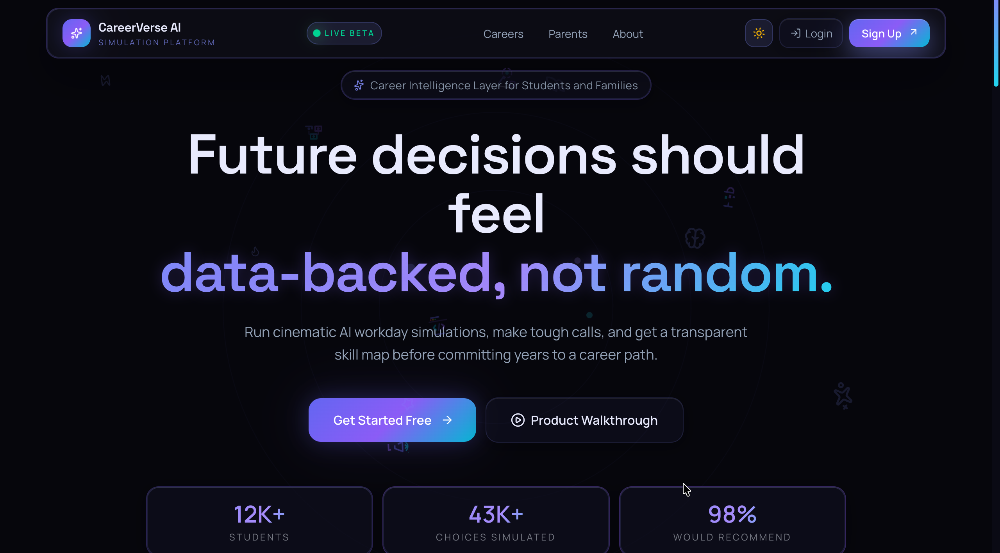
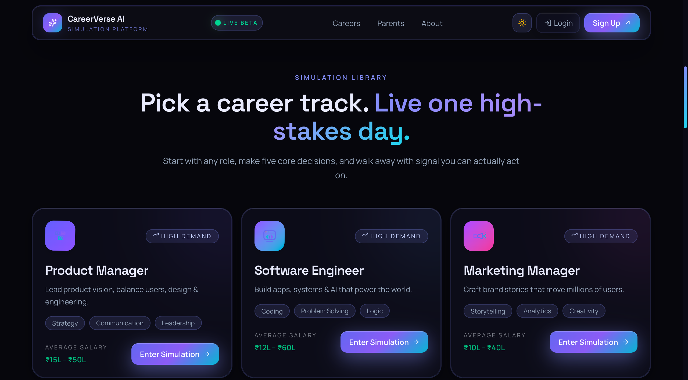

# 🚀 CareerVerse AI

> Future decisions should feel **data-backed, not random.**

---


# 🌌 Overview

CareerVerse AI is an immersive AI-powered career simulation platform designed to help students explore future careers through real-world decision-making experiences.

Instead of reading static career descriptions, users **live a high-stakes workday simulation** powered by AI.

Students can:
- Experience real job scenarios
- Make important career decisions
- Analyze skill alignment
- Explore future salary insights
- Receive AI-generated career reports

CareerVerse AI bridges the gap between:
> **“What students think a career is”**  
and  
> **“What the career actually feels like.”**

---
# 🖥️ Live Preview

### 👉 **https://career-verse-ai.vercel.app/**

---

# 🖼️ Project Preview

---

## 🌌 Landing Page



---

## 🎯 Career Simulation Library



---
# 📂 Project Structure

```bash
CareerVerse-AI/
│
├── .agents/
│   └── skills/
│
├── images/
│
├── src/
│   ├── app/
│   │   ├── careers/
│   │   ├── simulation/
│   │   ├── report/
│   │   ├── parent/
│   │   ├── about/
│   │   ├── stack/
│   │   └── api/
│   │
│   ├── components/
│   │
│   ├── lib/
│   │
│   ├── hooks/
│   │
│   ├── utils/
│   │
│   ├── types/
│   │
│   └── styles/
│
├── .gitignore
├── AGENTS.md
├── database.sql
├── eslint.config.mjs
├── next.config.ts
├── package.json
├── package-lock.json
├── postcss.config.js
├── tailwind.config.ts
├── tsconfig.json
├── vercel.json
└── README.md
```
---
# ⚙️ Installation & Setup

## 1️⃣ Clone Repository

```bash
git clone https://github.com/Akash-Wakade-7008-alt/CareerVerse-AI-.git
```

---

## 📦 Or Download ZIP File

Download the latest release:

🔗 https://github.com/Akash-Wakade-7008-alt/CareerVerse-AI-/releases/download/careerVerseAI-v.1.0/CareerVerse-Ai.zip

After downloading:

1. Extract the ZIP file
2. Open the folder in VS Code

---

## 2️⃣ Navigate Into Project

```bash
cd CareerVerse-AI-
```

---

## 3️⃣ Install Dependencies

```bash
npm install
```

---

## 4️⃣ Setup Environment Variables

Create:

```bash
.env.local
```

Add:

```env
GEMINI_API_KEY=your_gemini_key

NEXT_PUBLIC_SUPABASE_URL=your_supabase_url

NEXT_PUBLIC_SUPABASE_ANON_KEY=your_supabase_anon_key
```

---

## 5️⃣ Run Development Server

```bash
npm run dev
```

---

## 6️⃣ Open In Browser

```bash
http://localhost:3000
```

---


## Production Build

```bash
npx next build --webpack
```
---

# 🧭 Application Routes

| Route | Description |
|---|---|
| `/` | Home page |
| `/careers` | Career simulation library |
| `/simulation/[career]` | Interactive simulation |
| `/report` | AI-generated report |
| `/parent` | Parent dashboard |
| `/about` | Product vision |
| `/stack` | Tech architecture |
| `/api/simulate` | Simulation API |
| `/api/report` | Report API |
| `/api/health` | Runtime health |

---
# ✨ Core Features

## 🎮 AI Career Simulations
Experience realistic career workflows with AI-generated scenarios.

Examples:
- Software Engineer
- Product Manager
- Marketing Manager
- Designer
- Data Analyst

---

## 🧠 Intelligent Decision Engine
Users make critical decisions during simulations and receive:
- behavioral analysis
- skill alignment
- decision quality insights
- career compatibility scoring

---

## 📊 AI Career Reports
Generate personalized reports including:
- strengths & weaknesses
- skill maps
- career fit analysis
- growth recommendations

---

## 👨‍👩‍👧 Parent Dashboard
A dedicated interface helping parents:
- understand student strengths
- analyze career readiness
- monitor progress

---

## ⚡ Modern UI/UX
- Smooth animations
- Futuristic dark theme
- Responsive design
- Interactive transitions
- Professional landing pages

---


# 🏗️ Tech Stack

## Frontend
- Next.js 16
- React
- TypeScript
- Tailwind CSS
- Framer Motion

## Backend
- Next.js API Routes
- Gemini API
- Supabase

## AI & Data
- Google Gemini API
- AI Prompt Engineering
- Simulation Decision Trees


---

# 🚀 Deployment

## Recommended Platforms

| Service | Usage |
|---|---|
| Vercel | Frontend + Next.js hosting |
| Supabase | Database & auth |
| Gemini API | AI simulation engine |


---

# 🔥 Why CareerVerse AI Is Different

✅ Interactive AI career simulations  
✅ Real-world decision making  
✅ Personalized AI-generated reports  
✅ Parent involvement system  
✅ Beautiful futuristic UI  
✅ High scalability architecture  
✅ Portfolio-grade full-stack project  
✅ Real EdTech startup potential  

---

# 🌍 Vision

CareerVerse AI aims to solve one of the biggest problems students face:

> Choosing careers blindly.

The platform helps students make:
- smarter decisions
- data-backed choices
- informed career commitments

through immersive AI simulations.

---

# 📈 Future Improvements

- 🎙️ Voice-based simulations
- 🤖 AI mentors
- 📹 Video-based career immersion
- 🧠 Personality intelligence engine
- 🏆 Gamified learning system
- 🌐 Multiplayer simulations
- 📊 Real-time analytics dashboard
- 🎯 AI career roadmap generator

---

# 🤝 Contributing

Contributions are welcome!

```bash
Fork → Clone → Create Branch → Commit → Push → Pull Request
```

---


# 👨‍💻 Team

## Built During the Hackathon 🚀

CareerVerse AI was collaboratively developed with passion and innovation to reimagine career guidance using AI.

### Team Members
- Akash Wakade
- Sandeep Saha
- Sagar Gupta

Together, we worked on designing, developing, and building an AI-powered platform to help students explore careers through simulations, analytics, and personalized guidance.

---

# ⭐ Support

If you like this project:

🌟 Star the repository  
🍴 Fork the project  
📢 Share with others  

---

# 🌌 Final Thought

> “Students should not spend years discovering they chose the wrong path.”

CareerVerse AI helps students experience the future before committing to it.

---

<p align="center">
  Built with ❤️ using AI, creativity, and ambition.
</p>